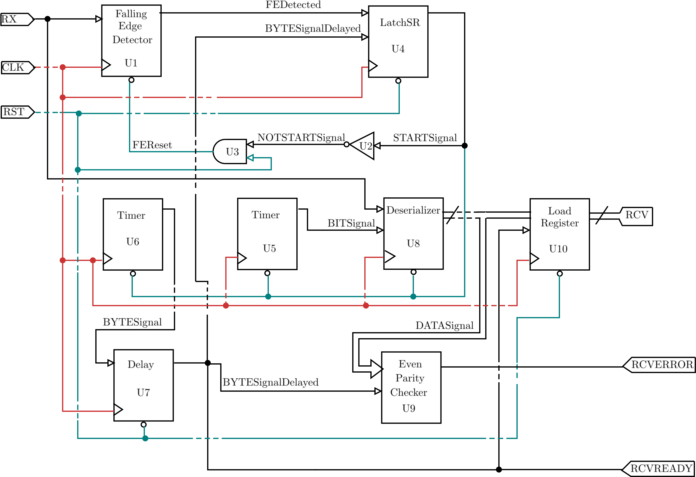

# UART receiver  

## Description:
A UART receiver with bauds, data width, even parity and stop bit configuration.
The amount of resources consumed by this implementation with 115200 bauds, 8 data bits, 1 parity bit and 1 stop bit are: <strong>30 LUTs + 54 FFs</strong> (Vivado 19.1, Build 2552052).

The following diagram corresponds to the top level file. The clock signal net is shown in red, reset signal is shown in aqua. Thin signals correspond to a width of 1 bit, thick signals to a width of n bits.

